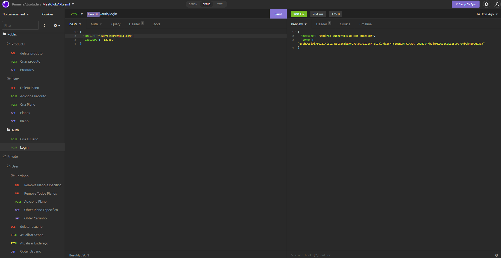

# Meat Club API

## 🎯 Sobre o projeto
API desenvolvida para o aplicativo Meat Club

## 💻 Tecnologias
✔ NodeJs com framework Express por ser mais rápido e ágil para criar rotas

✔ Typescript para tipar as variáveis e passar os argumentos para as funções corretamente reduzindo o risco de bugs além de autocompletar o código facilitando o desenvolvimento

✔ Banco de dados mysql

✔ Método raw para consultar os dados no banco de dados no backend
